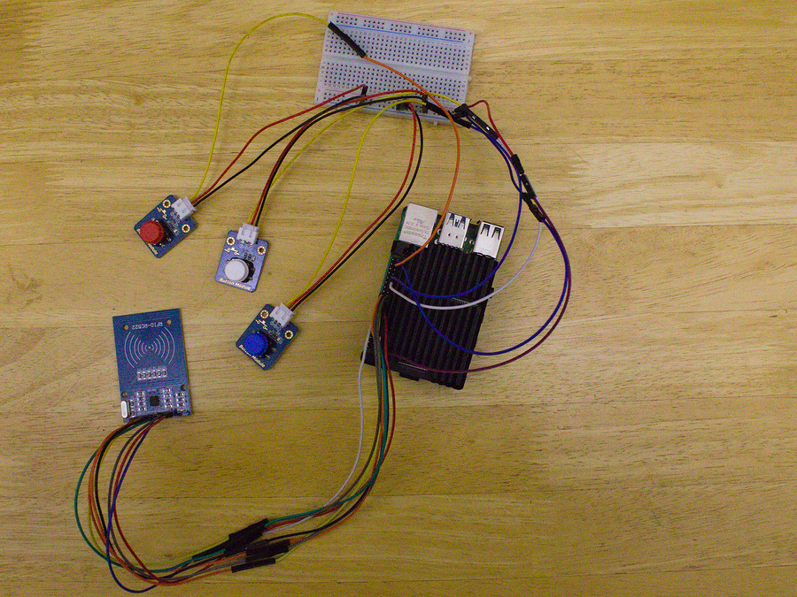

# A TonieBox-ROS2 clone



### Setup/Overview
- RaspberryPi: **RaspberryPi 4B**
- OS: Ubuntu-Server **(Ubuntu 20.04.3 LTS)**
- ROS-2 version: **Foxy Fitzroy**
- each Button is implemented as an own ROS2-Node in **C++**
- the RFID-RC522 module is implemented as an own ROS2-Node in **C++**
- on the RaspberryPi 4B are two ROS2-Nodes implemented in **Python** which handle the informations 
from the "Hardware"-parts

### How does it work
- after you setup and configured your ROS2 on your RaspberryPi
- add your soundfile path for the corresponding RFID-UUID into the database-server
- start the launch file `tonie_box.launch.py` from the `tonie_box_bringup` package 
(`ros2 launch tonie_box_bringup tonie_box.launch.py)
- now you can put a Figure/RFID token/card on the RFID reader and it will start playing the sound which belongs
to the RFID-UUID
- removing the Figure/RFID token/card will stop playing the soundfile
- pressing/holding the **white button** will **decrease the sound**
- pressing/holding the **blue button** will **increase the sound**
- pressing the **red button** will **pause/resume** playing the soundfile

---
### Hardware
- you find everything to the Hardware inside of `src/cpp_pkg/`

### Software
- you find everything to the Software inside of `src/python_pkg/`

---
#### wiringPi overview Table
```
+-----+-----+---------+------+---+---Pi 4B--+---+------+---------+-----+-----+
| BCM | wPi |   Name  | Mode | V | Physical | V | Mode | Name    | wPi | BCM |
+-----+-----+---------+------+---+----++----+---+------+---------+-----+-----+
|     |     |    3.3v |      |   |  1 || 2  |   |      | 5v      |     |     |
|   2 |   8 |   SDA.1 | ALT0 | 1 |  3 || 4  |   |      | 5v      |     |     |
|   3 |   9 |   SCL.1 | ALT0 | 1 |  5 || 6  |   |      | 0v      |     |     |
|   4 |   7 | GPIO. 7 |   IN | 1 |  7 || 8  | 1 | ALT5 | TxD     | 15  | 14  |
|     |     |      0v |      |   |  9 || 10 | 1 | ALT5 | RxD     | 16  | 15  |
|  17 |   0 | GPIO. 0 |   IN | 0 | 11 || 12 | 1 | IN   | GPIO. 1 | 1   | 18  |
|  27 |   2 | GPIO. 2 |   IN | 0 | 13 || 14 |   |      | 0v      |     |     |
|  22 |   3 | GPIO. 3 |   IN | 0 | 15 || 16 | 0 | IN   | GPIO. 4 | 4   | 23  |
|     |     |    3.3v |      |   | 17 || 18 | 0 | IN   | GPIO. 5 | 5   | 24  |
|  10 |  12 |    MOSI | ALT0 | 0 | 19 || 20 |   |      | 0v      |     |     |
|   9 |  13 |    MISO | ALT0 | 0 | 21 || 22 | 1 | IN   | GPIO. 6 | 6   | 25  |
|  11 |  14 |    SCLK | ALT0 | 0 | 23 || 24 | 1 | OUT  | CE0     | 10  | 8   |
|     |     |      0v |      |   | 25 || 26 | 1 | OUT  | CE1     | 11  | 7   |
|   0 |  30 |   SDA.0 |   IN | 1 | 27 || 28 | 1 | IN   | SCL.0   | 31  | 1   |
|   5 |  21 | GPIO.21 |   IN | 1 | 29 || 30 |   |      | 0v      |     |     |
|   6 |  22 | GPIO.22 |   IN | 1 | 31 || 32 | 0 | IN   | GPIO.26 | 26  | 12  |
|  13 |  23 | GPIO.23 |   IN | 0 | 33 || 34 |   |      | 0v      |     |     |
|  19 |  24 | GPIO.24 |   IN | 0 | 35 || 36 | 1 | IN   | GPIO.27 | 27  | 16  |
|  26 |  25 | GPIO.25 |   IN | 1 | 37 || 38 | 0 | IN   | GPIO.28 | 28  | 20  |
|     |     |      0v |      |   | 39 || 40 | 0 | IN   | GPIO.29 | 29  | 21  |
+-----+-----+---------+------+---+----++----+---+------+---------+-----+-----+
| BCM | wPi |   Name  | Mode | V | Physical | V | Mode | Name    | wPi | BCM |
+-----+-----+---------+------+---+---Pi 4B--+---+------+---------+-----+-----+
```
